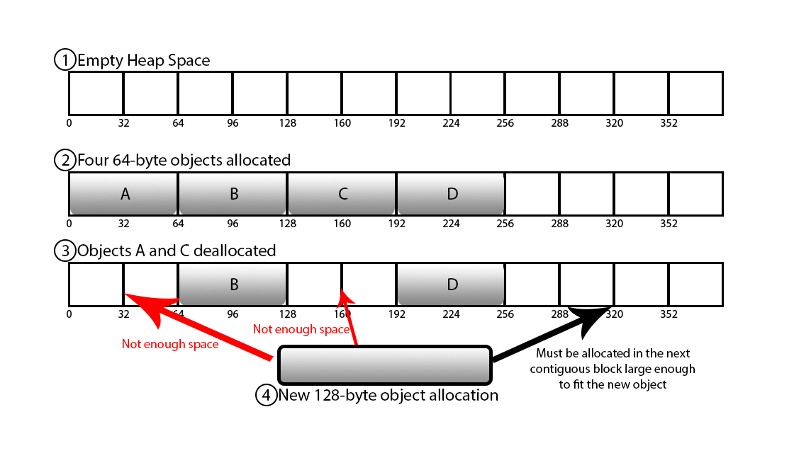

# Dynamic-Memory-Allocator

A java based project simulating a Dynamic Memory Allocator. Included allocate, free and de-fragment functions, modelling different processes involved in the actual allocator.

Part of Assignmet 1-3 of the course COL106: Data Structures and Algorithms, first semester 2020.

## Introduction
The allocator will be having information about the memory spaces that would be currently occupied by other programs and the memory spaces that are currently available, so that whenever a program asks for memory only the memory block that is marked free (or currently available) will be given to that program. Now whenever a free memory block is given to a program then it is marked as occupied (or allocated) so other programs can not access it. Whenever the program finishes its execution, the concerned memory block should be made available again (or freed).

The allocator decides the actual address each program will have based on the size of memory it requires. Two algorithms for finding the address are implemented here:
1. **First Fit**: The first address having a memory block of size greater than or equal to required memory size is used
2. **Best Fit**: The address having the smallest memory block of size just greater than or equal to required memory size is used.

A simple boolean is used to switch between these

### Fragmentation

After some time, the memory gets fragmented into smaller sized free blocks and these blocks cannot be reallocated even though the required contiguous free memory is available. In this case, fragmented memory is more likely to remain unused and thus it will lead to wastage to space. This problem is called Fragmentation.

  

### Defragmentor

To solve the problem of fragmentation, a defragmentor is usually used after some number of executions. A defragmentor checks for free blocks that are next to each other and combines them into larger free blocks. Running a defragmentor periodically reduces the fragmentation of memory and avoids space wastage.

## Implementation details

Abstract datatype dictionary is used to implement allocate, free and defragment functions. The dictionary object must have these functions:
1. Insert: To add an element in the dictionary
2. Delete: To delete an element from the dictionary
3. Find: To find a particular key, also depending on a boolean, get smallest greater than this (for best fit algorithm)
4. getNext: to get next element for a complete traversal of the dictionary
5. sanity: To check invariants and other unit tests to ensure proper working of the dictionary.

## Optimisations

Starting from Linked Lists, the dictionary is further optimised using BSTrees and AVL trees. Further details regarding the runtime complexities of each implementation are discussed in their individual folders.

## Instructions for use

Clone the repository and open a terminal inside it. Then run the following to compile all java files:
~~~ 
make all
~~~

Use run.sh script and Driver.java to test the code. Sample input and corresponding output are provided for convenience. The first line has number of trials, with each trail having first size of memory, number of commands and then the actual commands, of the format: 
1. Allocate < block_size >
2. Free < address >
3. Defragment

Currently, initialised to use AVL Tree as the datastructure to implement Dictionary. To change to BSTree or linked list, replace corresponding files with those in their folders and run.
